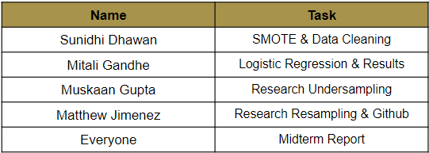
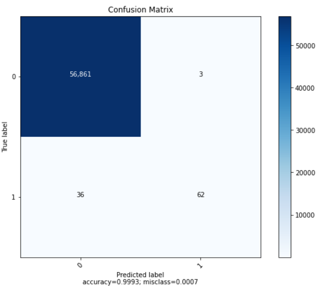
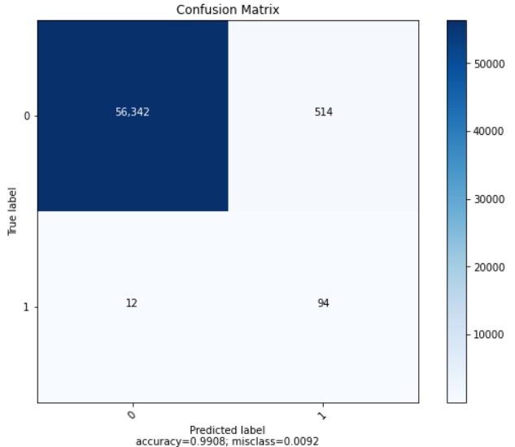
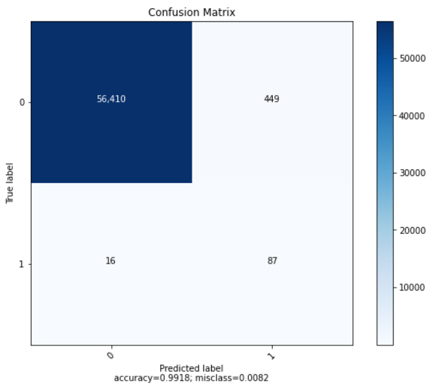
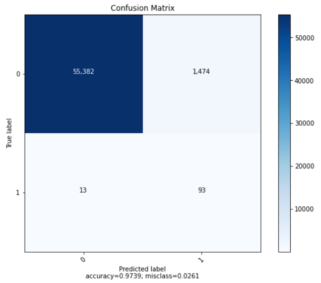
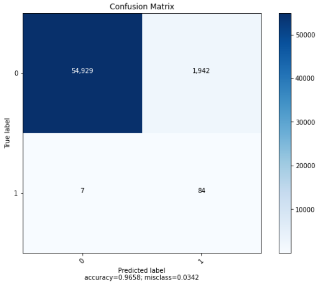
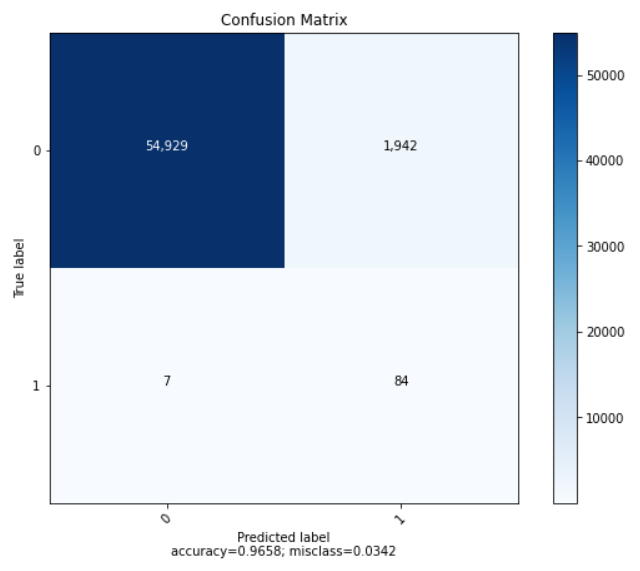

# Introduction & Background
This is an increasing problem around the globe. Financial Fraud Action UK, for example, a trade association for UK financial services reported that losses from fraud totaled 618 million pounds which is a 9% increase from the year before. Additionally, this contributed to the fifth consecutive year of increased credit card fraud.

[Credit card fraud detection is an active area of research](https://fraud-detection-handbook.github.io/fraud-detection-handbook/Foreword.html#): existing analyses of credit card fraud have included techniques including deep learning, correlation matrices, and confusion matrices. We noted some potential complexities to credit card fraud data from our literature review: few fraudulent entries, no null values, and high false positive or high false negative rate.

# Problem Definition
According to Experian, credit card CVV’s sell on the dark web for as little as $5 and include personal information such as name, Social Security number, date of birth, and complete account numbers.In the digital age, it is important to have sophisticated fraud detection techniques to protect people’s livelihoods. Our project focuses on the detection of credit card fraud, to identify, analyze, and prevent financial fraud.

# Dataset
We found a Kaggle dataset to suit our purpose, titled [Credit Card Fraud Detection](https://www.kaggle.com/datasets/mlg-ulb/creditcardfraud). It contains anonymized credit card transactions from September 2013 collected from European cardholders by the University of Brusells and the Machine Learning Group. The data is labeled as either fraudulent or genuine and is highly unbalanced, as the positive class/frauds account for 0.172% of all transactions with a total of 284,807 transactions.

# Methods
Our dataset is complete, so minimal cleaning is required. Because the dataset is very imbalanced, we have chosen to use the data preprocessing technique of oversampling on fraudulent transactions. 

We plan to detect fraud using GMM clustering, logistic regression analysis, and a multi-layer perceptron neural network. GMM results in a soft-clustering output that we can compare against the dataset’s labeled output to determine the model’s accuracy. Regression analysis (in our case, logistic regression) can be used to identify the correlation between the input parameters and fraudulence. Finally, a well-tuned MLP neural network for classification will likely serve as the basis of comparison.

# Potential Results & Discussion
From a literature review, we found that Precision, Recall, F-score, and AUC would be the most suitable metrics for the unbalanced nature of our dataset. Specifically, for GMM, we plan to use the specificity, recall, and Balanced Accuracy of GMM. For regression analysis, we aim to use a straightforward mean squared or root squared error. Lastly, for MLP, we plan to use recall, precision and F-1 score. The area under the precision-recall curve (AUPRC) is also a useful performance metric in our problem setting since we care a lot about finding the positive examples.
# Contribution Table

_Note: Person(s) in parenthesis are supporters, to help with research, ideas, and issues. Person(s) outside of parenthesis are hold main responsibilities for code implementation._

# Gantt Chart

[Please visit this link](https://docs.google.com/spreadsheets/d/1po2iJ1vFaG1CmB4J_Djwdk4p0TJhpWTq/edit?usp=sharing&ouid=108835189571718457513&rtpof=true&sd=true)

# Project Proposal Video

[Please visit this link to view the video.](https://drive.google.com/file/d/1r7rxllHFUsLnQqLfOq9kNSNOA2zKj3Yu/view?usp=sharing) [You can also visit this link to see our slides!](https://docs.google.com/presentation/d/1XgGfCcNP65d0k5lsMeJvIVTUFTnzbxMga3VwtFhcM-E/edit?usp=sharing)

If there are any issues, please let us know!

## Data Cleaning

We didn’t have to run extensive cleaning since all our entries were complete and in good form. This is with the exception of minor changes such as eliminating newline characters to not interfere with the values. We split our dataset into “data” as floats and “labels” as integers.

## Data Preprocessing

PCA is one of the most prominent pre-processing methods to improve classifier performance. Our dataset had already been run through PCA and contained 28 numerical input variables which were the result of this PCA transformation. 

We scaled this data using StandardScaler from the sklearn.preprocessing library and split our data and labels into training and test at a 80:20 split. 

For cross validation, we employed StratifiedShuffleSplit from sklearn.model_selection for splitting instead of a regular unbiased split. This cross validation method combines k-fold and shuffling techniques to maintain the percentage of majority and minority samples across folds. 

	Our data reflects a majority: minority ratio of 227451: 394. For resampling techniques, we chose oversampling since we wanted to equalize this majority: minority ratio without losing a lot of data. For oversampling, we used the popular SMOTE (Synthetic Minority Oversampling Technique) library that is widely used for resampling highly unbalanced datasets. As the name suggests, this technique generates synthetic data by interpolating samples from the minority class using nearest neighbors.  

	We also tried employing a combination of undersampling and oversampling to balance the distortion caused in minority class if we overpopulated it too far. For this we used RandomUnderSampler from the imblearn undersampling library. We were inspired by the approach of this article: https://machinelearningmastery.com/random-oversampling-and-undersampling-for-imbalanced-classification. 

# Results

Since our data is highly unbalanced, we cannot rely on just precision to discern how effective our model is. Using the terminology of positives, negatives, false and true, we define positives to be fraudulent transactions and negatives to be non-fraudulent, and true to be aligned with the ground truth and vice versa. For example, if our model predicts a non-fraudulent transaction to be fraudulent, it is considered a false positive. 

Our data contains ~98.3% non-fraudulent cases and 1.7% fraudulent cases. If we just use accuracy, a model that always predicts “non-fraudulent” will achieve an accuracy of 98.3%. Out of context, this is a great accuracy. However, for an unbalanced dataset, it tells us nothing about how well the model fits our dataset. Therefore, we must consider other performance metrics that measure other ratios involving true negatives, true positives, etc. 

For our analysis, we use recall, area under ROC curve (AUC-ROC), and accuracy as our performance metrics. Recall is defined as the ratio between the number of correctly identified positive samples and total number of samples classified as positive samples(this number would include the false positive samples). Accordingly, the higher the metric, the higher ability of the model to detect positive samples. 

AUC-ROC, overall, tells us how well the model can distinguish between classes on a normalized scale between 0 and 1. A higher number tells us the model is better at making this distinction. AUC-ROC is composed of two separate components: Area Under Curve(AUC) is a measure of separability. 

## Logistic Regression Results

We chose to implement logistic regression since it is a relatively straightforward but effective classification technique that is easy to interpret, analyze and debug. Additionally, a supervised method utilizes all the known information and provides a good first glance into our dataset. Logistic regression is also widely used and well suited for the task of binary classification which aligns with our problem definition of predicting whether a transaction is fraudulent or not. 

We employed LinearRegression from the sklearn.linear_model library to implement this method. Additionally, for an extra layer of verification, we implemented cross validation from sklearn.model_selection and paired it with our resampling techniques (SMOTE and random undersampling) in order to find the best combination. 

### Logistic Regression, no preprocessing:

| Accuracy | Recall   | Precision |
|----------|----------|-----------|
| 0.999315 | 0.816300 | 0.854096  |

### Logistic Regression, with CV:

| Accuracy | Recall   | Precision |
|----------|----------|-----------|
| 0.999069 | 0.938876 | 0.740027  |

### Logistic Regression, with SMOTE:

| Accuracy | Recall   | Precision |
|----------|----------|-----------|
| 0.991170 | 0.965630 | 0.771072  |

### Logistic Regression with CV and SMOTE:

| Accuracy | Recall   | Precision |
|----------|----------|-----------|
| 0.991837 | 0.918382 | 0.727601  |

### Logistic Regression with Undersampling:

| Accuracy | Recall   | Precision |
|----------|----------|-----------|
| 0.973895 | 0.925717 | 0.466111  |

### Logistic Regression with Undersampling and CV

| Accuracy | Recall   | Precision |
|----------|----------|-----------|
| 0.965784 | 0.944465 | 0.677143  |

# References 

Bachmann, J. M., Bhat, N., & Luo. (2021, May 3). Credit Card Fraud Detection. 

Draelos, R. (2019, March 2). Measuring Performance: AUPRC and Average Precision [web log]. Retrieved October 7, 2022, from https://glassboxmedicine.com/2019/03/02/measuring-performance-auprc/. 

Department of Justice, Federal Trade Commission. 2021, February. Consumer Sentinel Network: Data Book 2020. https://www.ftc.gov/system/files/documents/reports/consumer-sentinel-network-data-book-2020/csn_annual_data_book_2020.pdf

Gomila, R. (2019, July 11). Logistic or linear? Estimating causal effects of experimental treatments on binary outcomes using regression analysis. https://doi.org/10.31234/osf.io/4gmbv

Kulatilleke. (2022). Challenges and Complexities in Machine Learning based Credit Card Fraud Detection. https://doi.org/10.48550/arXiv.2208.10943

Le Borgne, Y., Siblini, W., Lebichot, B., and Bontempi, G. (2022). Reproducible Machine Learning for Credit Card Fraud Detection - Practical Handbook. https://github.com/Fraud-Detection-Handbook/fraud-detection-handbook

Porkess, & Mason, S. (2012). Looking at debit and credit card fraud. Teaching Statistics, 34(3), 87–91. https://doi.org/10.1111/j.1467-9639.2010.00437.x

